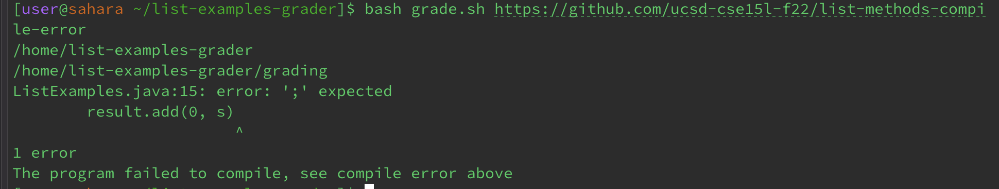

# CSE15L Lab Report 5
## Putting it all together
---
## Part 1: Debugging Scenario
**Student_User**

*I wrote a script to test and calculate the student submission's score, however, whenever I try to use the bash script with a file, I get the same symptom in the terminal output each time regardless of the file.  As the file has been processed, I think the bug might be somewhere in my code for calculating the score. The command lines ran were `bash grade.sh [https://github.com/ucsd-cse15l-f22/list-methods-compile-error](https://github.com/ucsd-cse15l-f22/list-methods-compile-error)` and `bash grade.sh [https://github.com/ucsd-cse15l-f22/list-methods-filename](https://github.com/ucsd-cse15l-f22/list-methods-filename)`. While the list-methods-compile-error has a syntax error of a missing semicolon, the file list-methods-filename only has a file with a wrong name so it should not be receiving the same output. The output received for each command line was identical, as seen by below despite the different expected behavior of each file:*
```
/home/list-examples-grader
/home/list-examples-grader/grading
ListExamples.java:15: error: ';' expected
        result.add(0, s)
                        ^
1 error
The program failed to compile, see compile error above
```

The file list-methods-compile-error contains:
```
import java.util.ArrayList;
import java.util.List;

interface StringChecker { boolean checkString(String s); }

class ListExamples {

  // Returns a new list that has all the elements of the input list for which
  // the StringChecker returns true, and not the elements that return false, in
  // the same order they appeared in the input list;
  static List<String> filter(List<String> list, StringChecker sc) {
    List<String> result = new ArrayList<>();
    for(String s: list) {
      if(sc.checkString(s)) {
        result.add(0, s)
      }
    }
    return result;
  }


  // Takes two sorted list of strings (so "a" appears before "b" and so on),
  // and return a new list that has all the strings in both list in sorted order.
  static List<String> merge(List<String> list1, List<String> list2) {
    List<String> result = new ArrayList<>();
    int index1 = 0, index2 = 0;
    while(index1 < list1.size() && index2 < list2.size()) {
      if(list1.get(index1).compareTo(list2.get(index2)) < 0) {
        result.add(list1.get(index1));
        index1 += 1;
      }
      else {
        result.add(list2.get(index2));
        index2 += 1;
      }
    }
    while(index1 < list1.size()) {
      result.add(list1.get(index1));
      index1 += 1;
    }
    while(index2 < list2.size()) {
      result.add(list2.get(index2));
      index1 += 1;
    }
    return result;
  }


}
```
Whereas, this is the content of the file list-methods-filename contains:
```
import java.util.ArrayList;
import java.util.List;

interface StringChecker { boolean checkString(String s); }

class ListMethods {

  // Returns a new list that has all the elements of the input list for which
  // the StringChecker returns true, and not the elements that return false, in
  // the same order they appeared in the input list;
  static List<String> filter(List<String> list, StringChecker sc) {
    List<String> result = new ArrayList<>();
    for(String s: list) {
      if(sc.checkString(s)) {
        result.add(s);
      }
    }
    return result;
  }


  // Takes two sorted list of strings (so "a" appears before "b" and so on),
  // and return a new list that has all the strings in both list in sorted order.
  static List<String> merge(List<String> list1, List<String> list2) {
    List<String> result = new ArrayList<>();
    int index1 = 0, index2 = 0;
    while(index1 < list1.size() && index2 < list2.size()) {
      if(list1.get(index1).compareTo(list2.get(index2)) < 0) {
        result.add(list1.get(index1));
        index1 += 1;
      }
      else {
        result.add(list2.get(index2));
        index2 += 1;
      }
    }
    while(index1 < list1.size()) {
      result.add(list1.get(index1));
      index1 += 1;
    }
    while(index2 < list2.size()) {
      result.add(list2.get(index2));
      index2 += 1;
    }
    return result;
  }


}
```

**TA_User**

*Assuming that the script for calculating the grade is correct, did you remove the file at the start of the script? There's a number of possible reasons but it might be that the student submission file is not being reset in the student folder, which makes the first entry of the file that was tested stay in there.*

**Student_User**

*This is the output I received after recursively removing the file stored in the student folder with `rm -rf student` at the beginning of the script. It is now working, thank you!*



---
## Part 2: Reflection

In the second half of the quarter, I was introduced to command-line editors, such as, vim. With vim, I'm able to make edits to the code from the terminal with only keys rather than clicking multiple times. I learned how to navigate the terminal using vim (hjkl), shortcuts to quickly delete a word (ce) or navigating swiftly, and the many key combinations to delete particular lines or words. Although learning vim was a hassle for me at first with all the new key combinations and unknown navigation keys, I now find it very interesting because of all the many different ways to edit.
