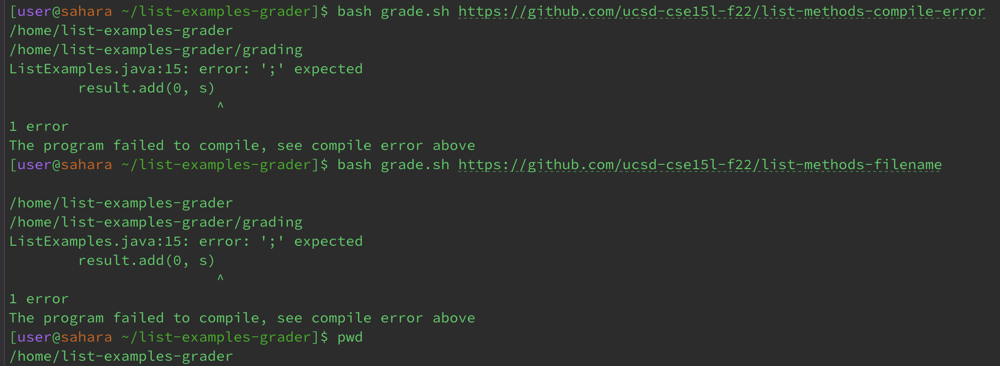

# CSE15L Lab Report 5
## Putting it all together
---
## Part 1: Debugging Scenario
**Student_User**
*I wrote a script to test and calculate the student submission's score, however, whenever I try to use the bash script with a file, I get the same symptom in the terminal output each time regardless of the file. As the file has been processed, I think the bug might be somewhere in my code for calculating the score.* 

**TA_User**
*Have you checked___? I'm unable to fully assist as I would need more context of the code.*

---
## Part 2: Reflection
In the second half of the quarter, I was introduced to command-line editors, such as, vim. With vim, I'm able to make edits to the code from the terminal with only keys rather than clicking multiple times. I learned how to navigate the terminal using vim (hjkl), shortcuts to quickly delete a word (ce) or navigating swiftly, and the many key combinations to delete particular lines or words. Although learning vim was a hassle for me at first with all the new key combinations and unknown navigation keys, I now find it very interesting because of all the many different ways to edit.
